```mermaid
flowchart TD
    Start([MCP Tool Request]) --> Extract[Extract userId & resourceId]
    Extract --> CheckCache{Check Redis<br/>for permissions}
    
    CheckCache -->|Hit| ValidateGlobal[Validate Global Rights]
    CheckCache -->|Miss| FetchPerms[Fetch from Clarity API]
    
    FetchPerms --> CachePerms[Cache permissions<br/>15 min TTL]
    CachePerms --> ValidateGlobal
    
    ValidateGlobal -->|Has Right| ValidateOBS[Validate OBS Access]
    ValidateGlobal -->|No Right| DenyGlobal[Deny: Lacks global right]
    
    ValidateOBS -->|Has Access| ValidateInstance[Validate Instance Access]
    ValidateOBS -->|No Access| DenyOBS[Deny: Lacks OBS access]
    
    ValidateInstance -->|Has Access| Allow[✅ ALLOW: Execute Tool]
    ValidateInstance -->|No Access| DenyInstance[❌ DENY: No resource access]
    
    DenyGlobal --> LogDenial[Log denial reason]
    DenyOBS --> LogDenial
    DenyInstance --> LogDenial
    
    Allow --> ExecuteTool[Execute MCP Tool]
    ExecuteTool --> ReturnResult([Return Result])
    
    LogDenial --> ReturnError([Return Error with Reason])
    
    style Start fill:#e1f5ff
    style Allow fill:#c8e6c9
    style ExecuteTool fill:#a5d6a7
    style ReturnResult fill:#81c784
    style DenyGlobal fill:#ffcdd2
    style DenyOBS fill:#ffcdd2
    style DenyInstance fill:#ffcdd2
    style LogDenial fill:#ef9a9a
    style ReturnError fill:#e57373
```

```mermaid
graph TB
    subgraph Layer1["Layer 1: Network Security"]
        VPC[VPC with Private Subnets]
        SG[Security Groups]
        TLS[TLS 1.3 Encryption]
        WAF2[AWS WAF]
    end
    
    subgraph Layer2["Layer 2: Gateway Security"]
        RateLimit[Rate Limiting]
        IPWhitelist[IP Whitelist]
        SQLInject[SQL Injection Protection]
        XSS[XSS Protection]
        CSRF[CSRF Protection]
    end
    
    subgraph Layer3["Layer 3: Authentication"]
        SessionVal[Session Validation]
        JWTVerify[JWT Verification]
        TokenExp[Token Expiration]
        NoLeaks[No Tokens in Logs]
    end
    
    subgraph Layer4["Layer 4: Authorization"]
        PermCheck[Permission Validation]
        GlobalRights[Global Rights]
        OBSCheck[OBS Access]
        InstancePerm[Instance Permissions]
    end
    
    subgraph Layer5["Layer 5: Data Security"]
        EncryptRest[Encryption at Rest]
        EncryptTransit[Encryption in Transit]
        SecretsMgr[Secrets Manager]
        NoSensitive[No PII in Logs]
    end
    
    subgraph Layer6["Layer 6: Audit & Monitoring"]
        LogAll[Log All Operations]
        Alerts[Security Alerts]
        Monitoring[Real-time Monitoring]
        Compliance[Compliance Reporting]
    end
    
    Request[Incoming Request] --> Layer1
    Layer1 --> Layer2
    Layer2 --> Layer3
    Layer3 --> Layer4
    Layer4 --> Layer5
    Layer5 --> Layer6
    Layer6 --> Allowed[✅ Request Processed]
    
    Layer1 -.->|Blocked| Denied[❌ Request Denied]
    Layer2 -.->|Blocked| Denied
    Layer3 -.->|Blocked| Denied
    Layer4 -.->|Blocked| Denied
    
    style Layer1 fill:#ffebee
    style Layer2 fill:#fff3e0
    style Layer3 fill:#e8f5e9
    style Layer4 fill:#e1f5ff
    style Layer5 fill:#f3e5f5
    style Layer6 fill:#fff9c4
    style Allowed fill:#c8e6c9
    style Denied fill:#ffcdd2
```

```mermaid
flowchart LR
    subgraph Dev["Development"]
        Code[Write Code]
        Test[Unit Tests]
        Commit[Git Commit]
    end
    
    subgraph CI["CI Pipeline GitHub Actions"]
        Build[Build]
        Lint[Lint & Format]
        UnitTest[Run Unit Tests]
        IntTest[Integration Tests]
        Security[Security Scan]
    end
    
    subgraph CD["CD Pipeline"]
        BuildImg[Build Docker Image]
        Push[Push to ECR]
        Deploy[Deploy to Staging]
        SmokeTest[Smoke Tests]
    end
    
    subgraph Prod["Production"]
        Approve[Manual Approval]
        BlueGreen[Blue/Green Deploy]
        Monitor[Monitor Metrics]
        Rollback{Issues?}
    end
    
    Code --> Test
    Test --> Commit
    Commit --> Build
    Build --> Lint
    Lint --> UnitTest
    UnitTest --> IntTest
    IntTest --> Security
    Security -->|Pass| BuildImg
    Security -->|Fail| NotifyFail[Notify Team]
    
    BuildImg --> Push
    Push --> Deploy
    Deploy --> SmokeTest
    SmokeTest -->|Pass| Approve
    SmokeTest -->|Fail| NotifyFail
    
    Approve --> BlueGreen
    BlueGreen --> Monitor
    Monitor --> Rollback
    Rollback -->|Yes| RollbackAction[Rollback to Previous]
    Rollback -->|No| Success[✅ Deployment Success]
    
    style Dev fill:#e8f5e9
    style CI fill:#e3f2fd
    style CD fill:#fff9c4
    style Prod fill:#f3e5f5
    style Success fill:#c8e6c9
    style NotifyFail fill:#ffcdd2
    style RollbackAction fill:#ffccbc
```

```mermaid
flowchart TD
    User[👤 User] -->|1. Login| Clarity[Clarity PPM]
    Clarity -->|2. Navigate| ChatPage[Chat Page]
    ChatPage -->|3. Extract Session| SessionToken{Session Token}
    
    SessionToken -->|4. Validate| Middleware[Middleware API]
    Middleware -->|5. Check Cache| Redis[(Redis)]
    
    Redis -->|Cache Hit| JWT[6. Generate JWT]
    Redis -->|Cache Miss| ClarityAPI[Clarity API]
    ClarityAPI -->|User Data| Cache[7. Cache Data]
    Cache --> JWT
    
    JWT -->|8. Return Token| ChatPage
    ChatPage -->|9. User Message| Middleware
    
    Middleware -->|10. Verify JWT| Valid{Valid?}
    Valid -->|No| ErrorAuth[❌ 401 Error]
    Valid -->|Yes| ChatService[Chat Service]
    
    ChatService -->|11. Call AI| ClaudeAPI[Claude API]
    ClaudeAPI -->|12. Need Data| MCPServer[MCP Server]
    
    MCPServer -->|13. Check Permission| PermService[Permission Service]
    PermService -->|14. Validate| Redis
    PermService -->|15. Allowed| ClarityAPI
    
    ClarityAPI -->|16. Data| MCPServer
    MCPServer -->|17. Format| ClaudeAPI
    ClaudeAPI -->|18. Generate Response| ChatService
    
    ChatService -->|19. Stream| ChatPage
    ChatService -->|20. Save| PostgreSQL[(PostgreSQL)]
    
    ChatPage -->|21. Display| User
    
    style User fill:#e1f5ff
    style Middleware fill:#fff4e6
    style ChatService fill:#f3e5f5
    style Redis fill:#ffccbc
    style PostgreSQL fill:#d1c4e9
    style ClaudeAPI fill:#c8e6c9
    style MCPServer fill:#a5d6a7
    style ErrorAuth fill:#ffcdd2
```

# Clarity PPM AI Chatbot - Mermaid Diagrams
# Can be rendered in: GitHub, GitLab, draw.io, VSCode, Notion, etc.

# ============================================
# 1. SYSTEM ARCHITECTURE OVERVIEW (3 LAYERS)
# ============================================

# ============================================
# 2. AWS DEPLOYMENT ARCHITECTURE
# ============================================

# ============================================
# 3. AUTHENTICATION & SESSION FLOW
# ============================================

# ============================================
# 4. PERMISSION VALIDATION FLOW
# ============================================

# ============================================
# 5. CHAT MESSAGE FLOW WITH AI & MCP
# ============================================

# ============================================
# 6. MCP TOOL EXECUTION DETAILED
# ============================================

# ============================================
# 7. REDIS CACHING STRATEGY
# ============================================

# ============================================
# 8. SECURITY ARCHITECTURE (6 LAYERS)
# ============================================

# ============================================
# 9. ERROR HANDLING FLOW
# ============================================

# ============================================
# 10. MONITORING DASHBOARD METRICS
# ============================================

# ============================================
# 11. DEPLOYMENT PIPELINE
# ============================================

# ============================================
# 12. DATA FLOW DIAGRAM
# ============================================

# ============================================
# END OF DIAGRAMS
# ============================================

# How to use these diagrams:
# 
# 1. GitHub/GitLab:
#    - Just paste the code blocks in your README.md
#    - They will render automatically
#
# 2. Draw.io:
#    - Go to draw.io
#    - File > Import > Select "Mermaid"
#    - Paste the diagram code
#
# 3. VSCode:
#    - Install "Mermaid Preview" extension
#    - Open this file and use preview
#
# 4. Online Mermaid Editors:
#    - https://mermaid.live
#    - Paste code and export as PNG/SVG
#
# 5. Notion:
#    - Embed using /code block with language "mermaid"
#
# 6. Obsidian:
#    - Supports Mermaid natively in code blocks
